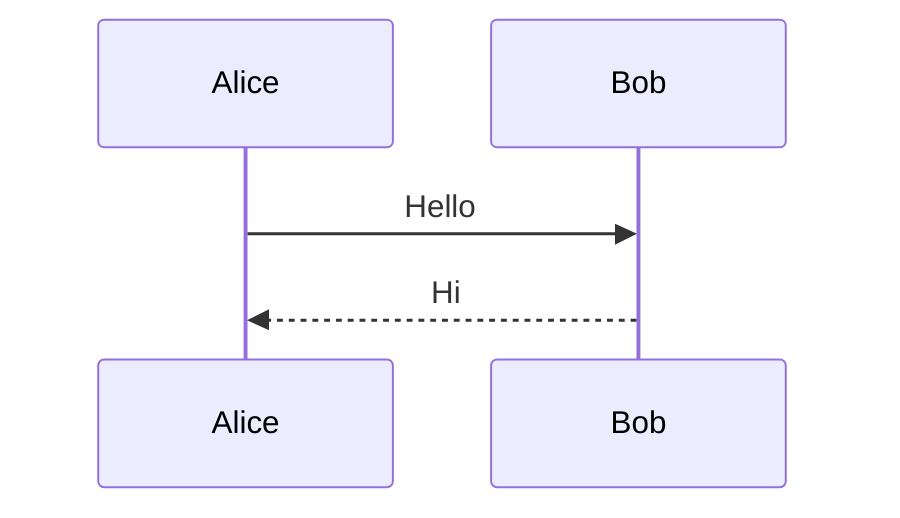

# Render Diagrams

The converter doesn't draw diagrams. With the `mermaid` setting on, it writes each fenced `mermaid` block as an element that holds the diagram source, and the Mermaid library on your page draws it. This page shows how to set that up.

## Turn On Diagrams

Set `mermaid` to `true` when you create the converter:

```php
$converter = new MarkdownConverter(mermaid: true);

$html = $converter->toHtml($markdown);
```

Each block like the following then becomes a `<pre class="mermaid">` element:

````markdown

````

If the Mermaid library never loads, readers see the diagram source as preformatted text.

## Draw the Diagrams

1. Load the Mermaid library on the page. The following example imports it from a CDN, and the [Mermaid documentation](https://mermaid.js.org/intro/getting-started.html) describes other ways to load it.
2. Turn off the automatic start, and keep `securityLevel` at its default or stricter. See [Keep the Page Safe](#keep-the-page-safe).
3. Put the converter's output in an element, and tell Mermaid which nodes to draw:

   ```html
   <div id="notes"><?= $html ?></div>

   <script type="module">
     import mermaid from 'https://cdn.jsdelivr.net/npm/mermaid@11/dist/mermaid.esm.min.mjs';

     mermaid.initialize({ startOnLoad: false, securityLevel: 'strict' });
     await mermaid.run({ nodes: document.querySelectorAll('#notes .mermaid') });
   </script>
   ```

Drawing only the elements inside your own container means that Mermaid never reads other parts of the page. If you install Mermaid with npm, import it from your bundler instead of from the CDN.

## Keep the Page Safe

The converter escapes the diagram source, so it can't add markup of its own. Mermaid then reads the source in the browser, and a stranger wrote that source, so Mermaid's settings are part of your page's safety:

- Keep `securityLevel` at `'strict'`, the default, or use `'sandbox'`, which is stricter. Don't use `'loose'`.
- Keep the library up to date, because the library has had security fixes.
- Mermaid is a large library, so consider loading it only on pages that contain a diagram.

See [Security](../security.md) for the rest of the safety model.

## Other Diagram Languages

The `mermaid` setting reads only `mermaid` fences. A fence for any other language stays an ordinary code block, and the converter gives it a class that names the language. For example, a `dot` fence becomes the following:

```html
<pre><code class="language-dot">digraph G {
  a -&gt; b
}
</code></pre>
```

You can hook a diagram library into that class on your page. Find the `code` elements for your language inside your own container, pass the text of each one to the library, and replace the `pre` element with what it draws:

```js
document.querySelectorAll('#notes pre > code.language-dot').forEach((code) => {
  const block = code.parentElement;
  const source = code.textContent;

  // Draw the source with your library, and then replace the block with the result.
});
```

The `textContent` property gives you the source as the author wrote it, because the browser undoes the escaping. The class comes from the first word after the opening fence, and the converter writes it only if the word holds letters, numbers, and a few symbols. The same hook works for `mermaid` fences when the `mermaid` setting is off.
