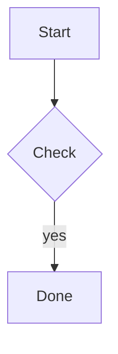

# Extra Syntax

The converter shows the syntax in this section as plain text or as code by default. Each setting turns one kind on.

## `indentedCode`

Default: `false`

A run of lines indented four spaces or more is a code block. Indented lines can't interrupt a paragraph.

## `setextHeadings`

Default: `false`

A line of `=` under a line of text makes an `h1`, and a line of `-` makes an `h2`.

```markdown
Title
=====

Section
-------
```

## `referenceLinks`

Default: `false`

Links and images written as `[text][label]`, `[label][]`, and `[label]`, with `[label]: https://example.com "Title"` written anywhere in the text. A definition can come after the link that uses it.

The converter doesn't read definitions that span more than one line.

## `taskLists`

Default: `false`

Shows `[ ]` and `[x]` at the start of a list item as the box characters `☐` and `☑`. They are characters, not form fields, so they stay in places that remove form elements.

```markdown
- [x] Write the tests
- [ ] Publish the package
```

## `mermaid`

Default: `false`

A fenced block whose first word is `mermaid` becomes a `pre` element with the class `mermaid`, which holds the diagram source. The converter doesn't draw the diagram. A page that loads the Mermaid library does that in the browser. See [Render Diagrams](../guides/diagrams.md).

````markdown

````

The converter writes the following HTML:

```html
<pre class="mermaid">graph TD
  A[Start] --&gt; B{Check}
  B --&gt;|yes| C[Done]</pre>
```

The converter escapes the source and doesn't read it as Markdown. It keeps the indentation, because some diagrams, such as mind maps, depend on it, and it drops blank lines at either end. The word has to be `mermaid` in lower case, and a block with no diagram in it stays an ordinary code block. A diagram has no length limit of its own, but `maxLength` and `maxDepth` still apply. With the setting off, the converter shows the block as code.

With `inlineStyles` on, the `pre` element gets the same style as a code block. The style stays on the element after Mermaid draws the diagram.
